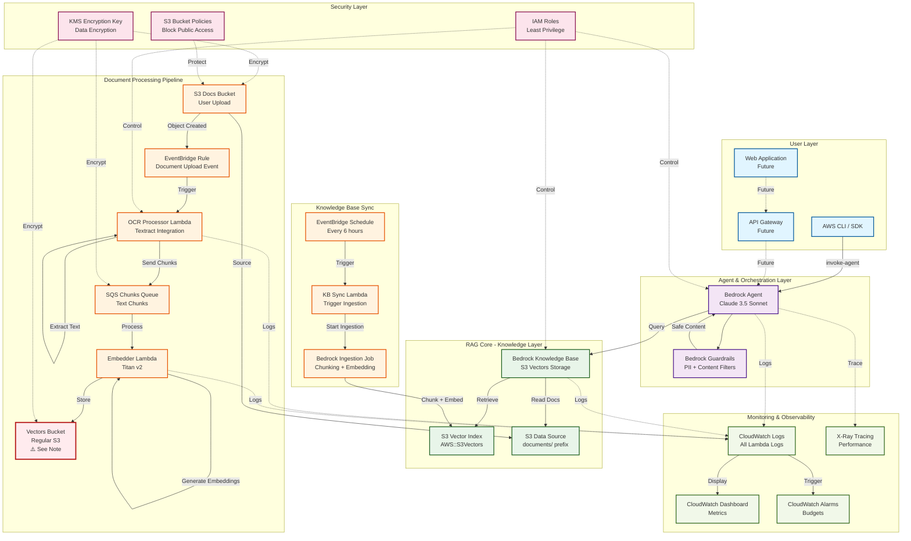
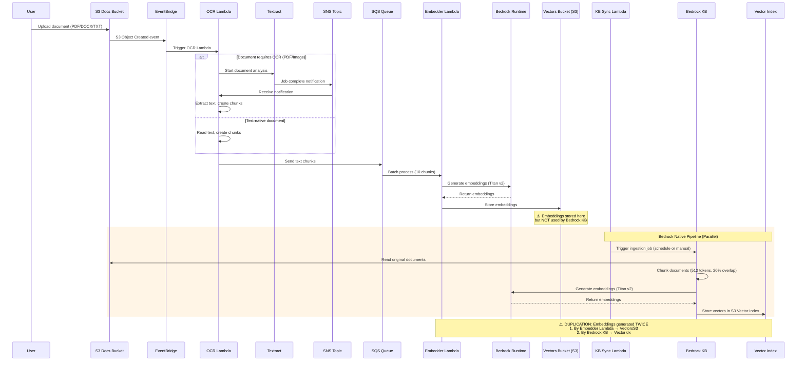
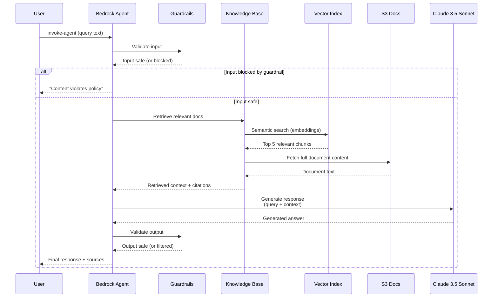
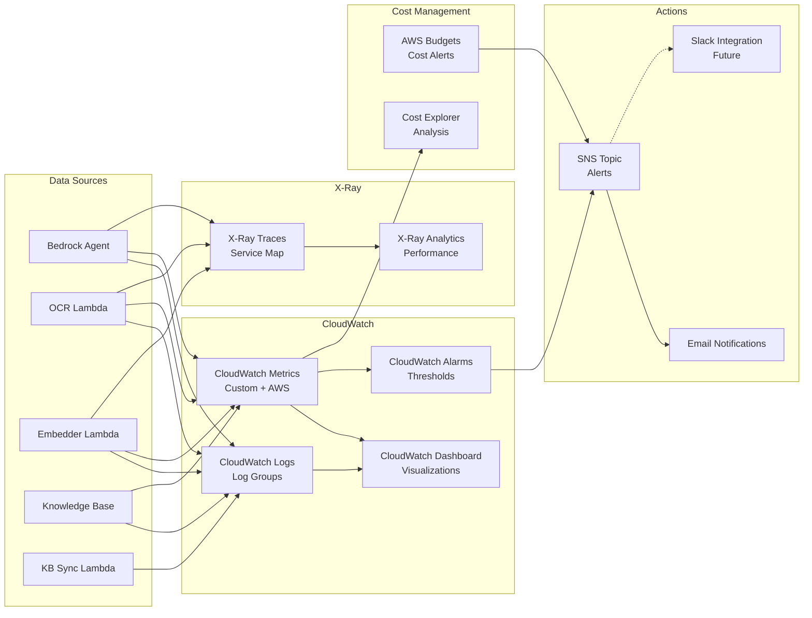
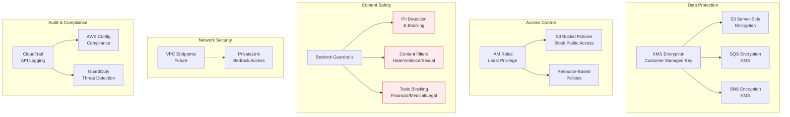
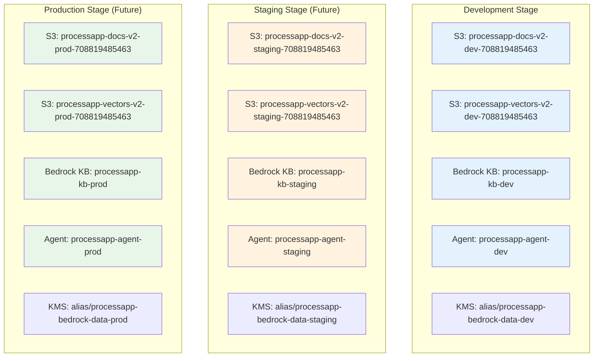
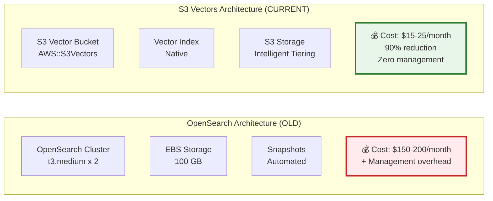
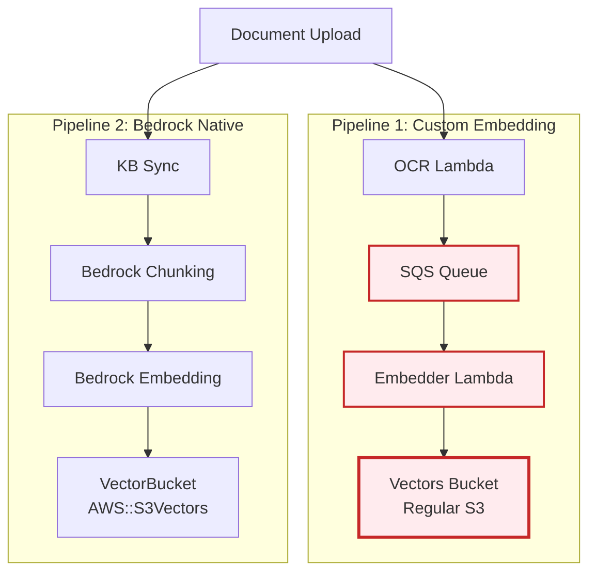
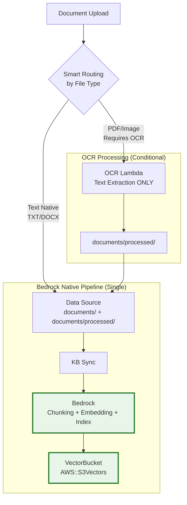
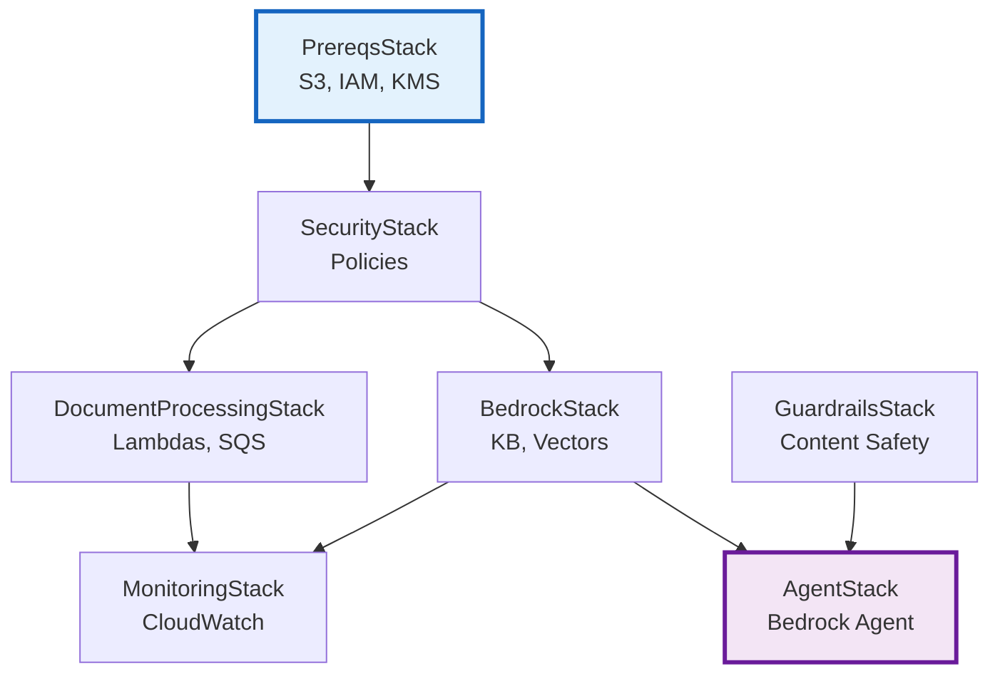

# ProcessApp RAG Infrastructure - Architecture Diagrams

Comprehensive architecture documentation for the ProcessApp RAG (Retrieval-Augmented Generation) system.

**Last Updated**: 2026-04-17
**Version**: 1.0 (Current Architecture with Embedder Lambda)

---

## Table of Contents

1. [System Overview](#system-overview)
2. [Main Architecture Diagram](#main-architecture-diagram)
3. [Document Ingestion Pipeline](#document-ingestion-pipeline)
4. [Query Flow Diagram](#query-flow-diagram)
5. [Monitoring and Observability](#monitoring-and-observability)
6. [Security Architecture](#security-architecture)
7. [Multi-Tenant Isolation](#multi-tenant-isolation)
8. [Cost Optimization Architecture](#cost-optimization-architecture)
9. [Component Details](#component-details)

---

## System Overview

ProcessApp RAG is a serverless, multi-tenant RAG system built on AWS Bedrock, featuring:

- **7 CloudFormation Stacks**: PrereqsStack, SecurityStack, BedrockStack, DocumentProcessingStack, GuardrailsStack, AgentStack, MonitoringStack
- **Foundation Model**: Claude 3.5 Sonnet for query responses
- **Embedding Model**: Amazon Titan v2 (1024 dimensions)
- **Vector Storage**: S3 Vectors (90% cheaper than OpenSearch)
- **Content Safety**: Bedrock Guardrails with PII filtering
- **OCR Processing**: AWS Textract for document extraction
- **Orchestration**: Bedrock Agent Core for query management

**Key Architecture Decisions**:
- S3 Vectors over OpenSearch (cost optimization)
- Serverless-first (Lambda, EventBridge, S3)
- Multi-region ready (currently single-region)
- Stage-based multi-tenancy (dev/staging/prod isolation)

---

## Main Architecture Diagram

### Complete System Architecture



**⚠️ Architecture Note**: The `VectorsBucket` (regular S3) stores embeddings from the Embedder Lambda, but Bedrock KB uses `VectorIndex` (AWS::S3Vectors) instead. This creates potential duplication. See [Architecture Simplification Proposal](#architecture-simplification-proposal) below.

---

## Document Ingestion Pipeline

### Current Ingestion Flow (with Embedder Lambda)



**Processing Time**:
- OCR (PDF with images): 30-120 seconds
- OCR (text PDF/DOCX): 5-15 seconds
- Embedding generation (per chunk): 1-2 seconds
- KB sync: 2-10 minutes (depending on document count)

---

## Query Flow Diagram

### Agent Query Execution Flow



**Query Latency Breakdown**:
- Guardrail validation (input): 50-100ms
- KB retrieval: 200-500ms
- Document fetch: 50-100ms
- Claude 3.5 Sonnet generation: 1-3 seconds
- Guardrail validation (output): 50-100ms
- **Total**: ~2-4 seconds

---

## Monitoring and Observability

### Monitoring Architecture



**Key Metrics Monitored**:
- Lambda invocations (OCR, Embedder, Sync)
- Lambda errors and throttles
- Agent invocation count
- Agent response latency
- KB query latency
- SQS queue depth
- Daily costs by service

---

## Security Architecture

### Security Layers



**PII Entities Detected**:
- Email addresses
- Phone numbers
- Social Security Numbers (SSN)
- Credit card numbers
- Person names
- Organizations
- Physical addresses
- Dates of birth

**Content Filter Levels**:
- Sexual content: HIGH
- Violence: HIGH
- Hate speech: HIGH
- Insults: MEDIUM
- Misconduct: MEDIUM
- Prompt attacks: HIGH

---

## Multi-Tenant Isolation

### Stage-Based Isolation Architecture



**Isolation Guarantees**:
- Separate S3 buckets per stage
- Separate IAM roles per stage
- Separate KMS keys per stage
- Separate CloudWatch log groups per stage
- No cross-stage resource access

**Resource Naming Convention**:
```
processapp-{resource}-{version}-{stage}-{accountId}
```

Examples:
- `processapp-docs-v2-dev-708819485463`
- `processapp-kb-dev`
- `processapp-agent-role-dev`

---

## Cost Optimization Architecture

### S3 Vectors vs OpenSearch Cost Comparison



**Cost Breakdown (1000 documents, 10K queries/month)**:

| Component | OpenSearch | S3 Vectors | Savings |
|-----------|------------|------------|---------|
| Compute | $120/month | $0 (serverless) | $120 |
| Storage | $30/month | $3/month | $27 |
| Data transfer | $10/month | $2/month | $8 |
| Management | Manual | Automatic | Time saved |
| **Total** | **$160/month** | **$5/month** | **~97%** |

---

## Architecture Simplification Proposal

### BEFORE: Current Architecture (with Duplication)



**Problems**:
- ❌ Embeddings generated TWICE (Lambda + Bedrock)
- ❌ `VectorsBucket` (regular S3) NOT used by Bedrock KB
- ❌ Extra components (Embedder, SQS)
- ❌ ~50% higher costs
- ❌ More points of failure

### AFTER: Simplified Architecture (Proposal)



**Benefits**:
- ✅ Embeddings generated ONCE (Bedrock only)
- ✅ Single pipeline (simpler architecture)
- ✅ Fewer components (no Embedder, no SQS)
- ✅ ~50% cost reduction
- ✅ Fewer failure points
- ✅ Faster processing (Bedrock optimized)

**To Implement**: See Phase 2.5 in main plan

---

## Component Details

### Stack Dependencies



### Resource Count by Stack

| Stack | Resources | Key Components |
|-------|-----------|----------------|
| PrereqsStack | 8 | S3 buckets (2), IAM roles (3), KMS key, Log groups (2) |
| SecurityStack | 6 | IAM policies, S3 bucket policies |
| BedrockStack | 5 | KB, Data Source, Vector Index, VectorBucket, Sync Lambda |
| DocumentProcessingStack | 8 | OCR Lambda, Embedder Lambda, SQS (2), SNS, EventBridge (2) |
| GuardrailsStack | 4 | Guardrail, Version, Custom resource Lambdas (2) |
| AgentStack | 4 | Agent, Agent Alias, IAM role, Policies |
| MonitoringStack | 12 | Dashboard, Alarms (5), Metric filters (6) |
| **Total** | **47** | CloudFormation resources |

### Deployment Order

1. **PrereqsStack** (no dependencies)
2. **SecurityStack** (depends on PrereqsStack)
3. **BedrockStack** (depends on SecurityStack)
4. **DocumentProcessingStack** (depends on SecurityStack)
5. **GuardrailsStack** (no dependencies, can be parallel)
6. **AgentStack** (depends on BedrockStack + GuardrailsStack)
7. **MonitoringStack** (depends on BedrockStack + DocumentProcessingStack)

**Deployment Time**: ~15-20 minutes for all stacks

---

## References

- [AWS Bedrock Documentation](https://docs.aws.amazon.com/bedrock/)
- [S3 Vectors Announcement](https://aws.amazon.com/blogs/aws/introducing-s3-vector-storage/)
- [Bedrock Agent Core](https://docs.aws.amazon.com/bedrock/latest/userguide/agents.html)
- [AWS Textract](https://docs.aws.amazon.com/textract/)
- Implementation: `infrastructure/lib/`
- Configuration: `infrastructure/config/environments.ts`

---

## Change Log

| Date | Version | Changes |
|------|---------|---------|
| 2026-04-17 | 1.0 | Initial architecture documentation |
| TBD | 2.0 | After Phase 2.5 simplification (if implemented) |

---

**Status**: Current architecture documentation
**Next Update**: After Phase 2.5 (architectural simplification) if implemented
