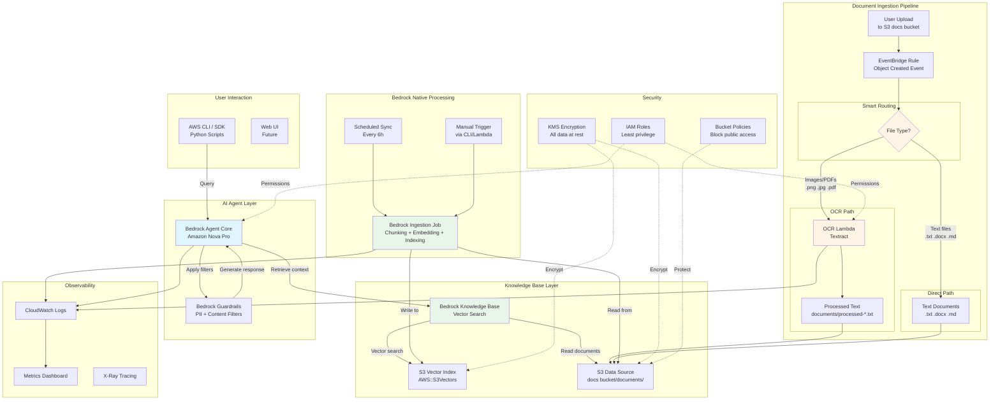
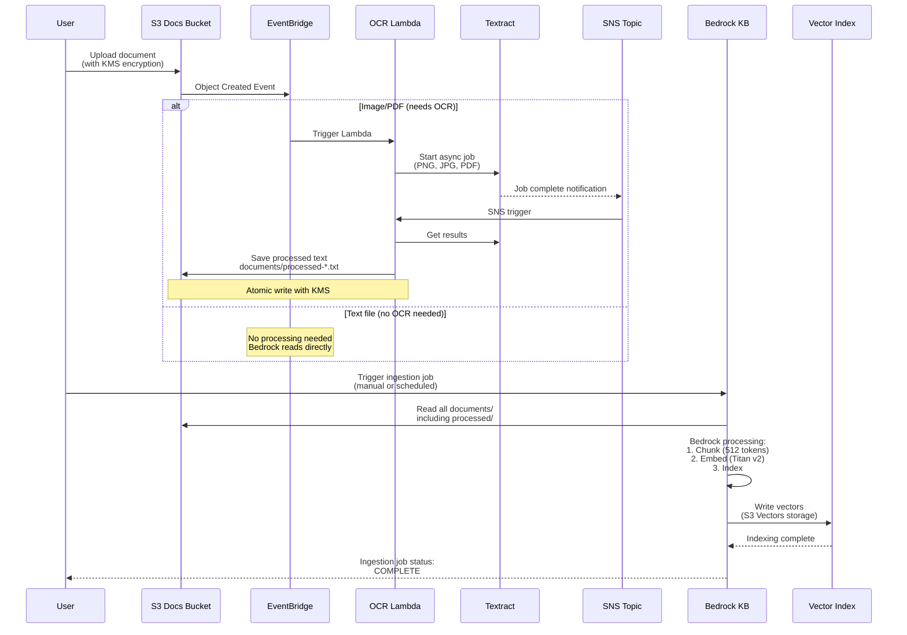
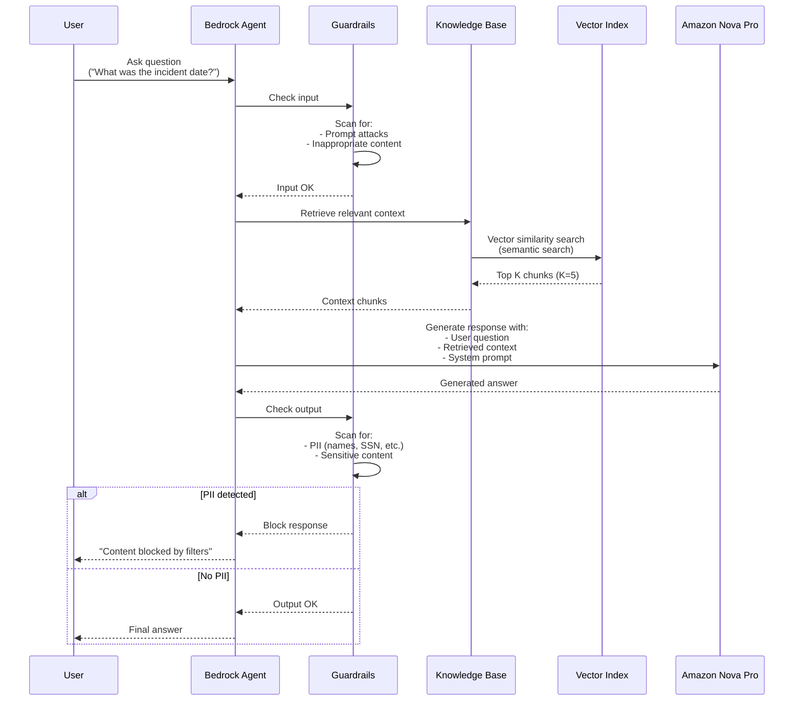
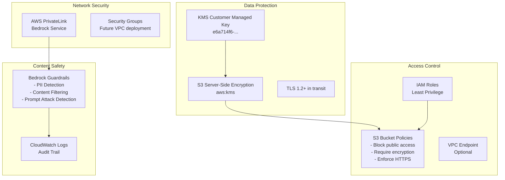

# ProcessApp RAG Infrastructure - Architecture Diagrams

Comprehensive architecture documentation for the ProcessApp RAG (Retrieval-Augmented Generation) system.

**Last Updated**: 2026-04-21
**Version**: 2.0 (Simplified Architecture - Bedrock Native Processing)

---

## Table of Contents

1. [System Overview](#system-overview)
2. [Main Architecture Diagram](#main-architecture-diagram)
3. [Document Ingestion Pipeline](#document-ingestion-pipeline)
4. [Query Flow Diagram](#query-flow-diagram)
5. [OCR Processing Flow](#ocr-processing-flow)
6. [Security Architecture](#security-architecture)
7. [Component Details](#component-details)
8. [Legacy Components](#legacy-components)

---

## System Overview

ProcessApp RAG is a serverless, multi-tenant RAG system built on AWS Bedrock, featuring:

- **7 CloudFormation Stacks**: PrereqsStack, SecurityStack, BedrockStack, DocumentProcessingStack, GuardrailsStack, AgentStack, MonitoringStack
- **Foundation Model**: Amazon Nova Pro for query responses
- **Embedding Model**: Amazon Titan Embed Text v2 (1024 dimensions)
- **Vector Storage**: S3 Vectors (90% cheaper than OpenSearch)
- **Content Safety**: Bedrock Guardrails with PII filtering
- **OCR Processing**: AWS Textract for document extraction
- **Orchestration**: Bedrock Agent Core for query management

**Key Architecture Decisions**:
- ✅ Bedrock native processing (chunking + embedding handled automatically)
- ✅ S3 Vectors over OpenSearch (cost optimization: $0.024/GB vs $0.24/GB)
- ✅ Serverless-first (Lambda, EventBridge, S3)
- ✅ Simplified OCR flow (extract text → save to S3 → Bedrock processes)
- ✅ Multi-region ready (currently single-region: us-east-1)
- ✅ Stage-based multi-tenancy (dev/staging/prod isolation)

---

## Main Architecture Diagram

### Complete System Architecture (Current Implementation)



**Key:**
- 🟦 Blue = AI/ML components
- 🟩 Green = Bedrock native processing
- 🟨 Yellow = Custom Lambda processing

---

## Document Ingestion Pipeline

### Detailed Ingestion Flow



### Smart Routing Logic

The system automatically routes documents based on file type:

| File Type | Extension | Processing Path | Output |
|-----------|-----------|-----------------|---------|
| Images | `.png`, `.jpg`, `.jpeg`, `.tiff` | OCR Lambda → Textract | `documents/processed-*.txt` |
| PDF Documents | `.pdf` | OCR Lambda → Textract | `documents/processed-*.txt` |
| Text Documents | `.txt`, `.docx`, `.md` | Direct to Bedrock | Original file read directly |

**Why this approach?**
- ✅ Only process files that need OCR (saves cost)
- ✅ Text files go directly to Bedrock (faster)
- ✅ All vectorization handled by Bedrock (consistent, optimized)

---

## Query Flow Diagram

### Agent Query Processing



### Guardrails Protection

**Input Filters:**
- ✅ Prompt injection detection
- ✅ Hate speech detection
- ✅ Violence/sexual content detection

**Output Filters:**
- ✅ PII redaction (names, SSN, credit cards, addresses)
- ✅ Content policy enforcement
- ✅ Hallucination detection (via Knowledge Base grounding)

---

## OCR Processing Flow

### Textract Integration Details

```mermaid
flowchart TB
    Start[PNG/PDF/JPG Upload] --> Check{EventBridge<br/>Rule Match}
    Check -->|documents/ prefix| OCRStart[OCR Lambda Triggered]

    OCRStart --> Textract1[Start Textract Job<br/>Async API]
    Textract1 --> SNS[Textract publishes<br/>to SNS topic]
    SNS --> OCRCallback[OCR Lambda<br/>SNS trigger]

    OCRCallback --> GetResults[Get Textract Results<br/>Paginated]
    GetResults --> Extract[Extract text<br/>from LINE blocks]

    Extract --> WriteTemp[Write to S3:<br/>documents/processed-{name}.txt]
    WriteTemp --> Encrypt{KMS<br/>Encryption}
    Encrypt -->|Success| Done[Processing Complete]
    Encrypt -->|Error| Retry[Log error & cleanup]

    Done --> Wait[Wait for KB Sync<br/>Manual or Scheduled]
    Wait --> KBRead[Bedrock reads<br/>processed text]
    KBRead --> Chunk[Bedrock chunks text<br/>512 tokens, 20% overlap]
    Chunk --> Embed[Bedrock generates embeddings<br/>Titan v2]
    Embed --> Index[Store in Vector Index<br/>S3 Vectors]

    style OCRStart fill:#fff4e6
    style Textract1 fill:#e1f5ff
    style Chunk fill:#e8f5e9
    style Embed fill:#e8f5e9
    style Index fill:#e8f5e9
```

**Textract Configuration:**
- **API**: `StartDocumentTextDetection` (async)
- **Features**: LINE detection (text extraction)
- **Notification**: SNS topic triggers Lambda when job completes
- **Average Duration**: 5-10 seconds for typical documents
- **Output Format**: Plain text (UTF-8)

---

## Security Architecture

### Security Layers



**Key Security Features:**
1. **Encryption at Rest**: All S3 objects encrypted with KMS
2. **Encryption in Transit**: TLS 1.2+ for all API calls
3. **PII Protection**: Automatic detection and blocking of sensitive data
4. **Access Logging**: CloudWatch Logs retain all API calls
5. **Least Privilege**: Each component has minimal required permissions

---

## Component Details

### 1. PrereqsStack

**Purpose**: Foundation infrastructure (S3, KMS, IAM)

| Resource | Name | Purpose |
|----------|------|---------|
| S3 Bucket | `processapp-docs-v2-dev-*` | Document storage |
| S3 Bucket | `processapp-vectors-v2-dev-*` | Legacy (not used) |
| KMS Key | `processapp-kms-dev` | Data encryption |
| IAM Role | `processapp-bedrock-kb-role-dev` | Bedrock KB permissions |

### 2. BedrockStack

**Purpose**: Knowledge Base and Vector Index

| Resource | Configuration |
|----------|---------------|
| Knowledge Base | S3 Vectors storage |
| Data Source | S3 bucket, `documents/` prefix |
| Vector Index | AWS::S3Vectors custom resource |
| Chunking | 512 tokens, 20% overlap |
| Embedding Model | Amazon Titan Embed Text v2 |

### 3. DocumentProcessingStack

**Purpose**: OCR processing with Textract

| Component | Configuration |
|-----------|---------------|
| OCR Lambda | Python 3.11, 1024 MB, 60s timeout |
| SNS Topic | Textract completion notifications |
| Textract Role | Allows Textract → SNS publish |
| EventBridge Rule | Triggers on S3 Object Created |

**Environment Variables:**
- `DOCS_BUCKET`: S3 bucket name
- `TEXTRACT_SNS_TOPIC_ARN`: SNS topic for notifications
- `TEXTRACT_ROLE_ARN`: IAM role for Textract
- `KMS_KEY_ID`: Encryption key
- `STAGE`: Deployment stage

### 4. AgentStack

**Purpose**: Bedrock Agent Core for queries

| Component | Configuration |
|-----------|---------------|
| Foundation Model | `amazon.nova-pro-v1:0` |
| Agent Alias | `live` (auto-routes to latest version) |
| Knowledge Base | Connected to RAG KB |
| Guardrails | PII + content filtering |
| Temperature | 0.7 |
| Max Tokens | 4096 |

### 5. GuardrailsStack

**Purpose**: Content safety and PII protection

| Filter Type | Configuration |
|-------------|---------------|
| **PII Entities** | EMAIL, PHONE, NAME, ADDRESS, US_SSN, CREDIT_CARD, US_PASSPORT, US_BANK_ACCOUNT, AGE |
| **Content Filters** | HATE (HIGH), INSULTS (MEDIUM), SEXUAL (HIGH), VIOLENCE (MEDIUM), MISCONDUCT (MEDIUM) |
| **Prompt Attack** | Input: HIGH, Output: NONE (required) |
| **Action** | BLOCK on detection |

---

## Legacy Components

### ⚠️ Components Deployed but NOT Used

The following exist in the infrastructure but are **inactive**:

| Component | Status | Reason |
|-----------|--------|--------|
| **Embedder Lambda** | 🔴 NOT USED | Bedrock generates embeddings natively |
| **SQS Chunks Queue** | 🔴 NOT USED | No chunking needed; Bedrock handles it |
| **vectorsBucket (regular S3)** | 🔴 NOT USED | Only VectorBucket (AWS::S3Vectors) is used |

**Why they exist:**
These were part of the original architecture design (Phase 1) where embedding generation was done manually. After implementing Phase 2.5 (Bedrock native processing), they became obsolete but remain deployed for potential rollback.

**Future Action:**
May be removed in a future infrastructure cleanup to reduce deployment size and CloudFormation complexity.

---

## Cost Breakdown

### Monthly Cost Estimate (1GB of documents, 1000 queries/month)

| Service | Usage | Cost |
|---------|-------|------|
| **S3 Docs Storage** | 1 GB | $0.023 |
| **S3 Vector Storage** | 1 GB vectors | $0.024 |
| **Bedrock Embeddings** | 1M tokens | $0.10 |
| **Bedrock Agent (Nova Pro)** | 1000 queries, 500K tokens | $3.00 |
| **Textract** | 100 pages OCR | $1.50 |
| **Lambda Invocations** | 1000 invocations | $0.20 |
| **CloudWatch Logs** | 5 GB | $0.25 |
| **KMS** | 1 key | $1.00 |
| **TOTAL** | | **~$6.00/month** |

**Cost Optimization:**
- ✅ S3 Vectors: 90% cheaper than OpenSearch ($0.024/GB vs $0.24/GB)
- ✅ Serverless: No idle costs
- ✅ Amazon Nova Pro: More cost-effective than Claude models

---

## Deployment Regions

### Current: Single Region

| Region | Stage | Status |
|--------|-------|--------|
| us-east-1 | dev | ✅ Active |

### Future: Multi-Region

Planned regions for production:
- **us-east-1** (Primary)
- **eu-west-1** (Europe)
- **ap-southeast-1** (APAC)

Multi-region requires:
- Cross-region S3 replication
- DynamoDB global tables (for session state)
- Route53 for DNS failover

---

## Change Log

### Version 2.0 (2026-04-21)
- ✅ Simplified architecture: Bedrock native processing
- ✅ Removed custom chunking/embedding logic
- ✅ OCR Lambda only extracts text (no SQS)
- ✅ Updated model: Amazon Nova Pro
- ✅ Marked legacy components

### Version 1.0 (2026-04-17)
- Initial architecture with Embedder Lambda
- Custom chunking and embedding pipeline
- Claude 3.5 Sonnet model

---

## References

- [AWS Bedrock Knowledge Bases](https://docs.aws.amazon.com/bedrock/latest/userguide/knowledge-base.html)
- [S3 Vector Storage](https://aws.amazon.com/blogs/aws/introducing-s3-vector-storage/)
- [AWS Textract](https://docs.aws.amazon.com/textract/latest/dg/what-is.html)
- [Bedrock Guardrails](https://docs.aws.amazon.com/bedrock/latest/userguide/guardrails.html)
